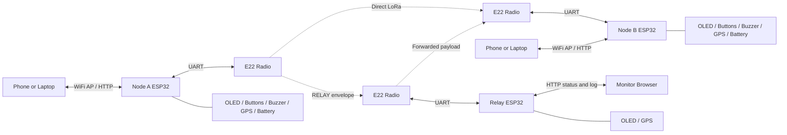
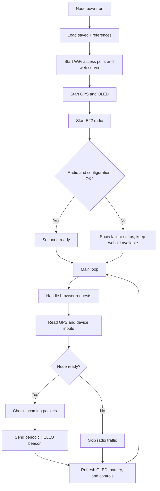
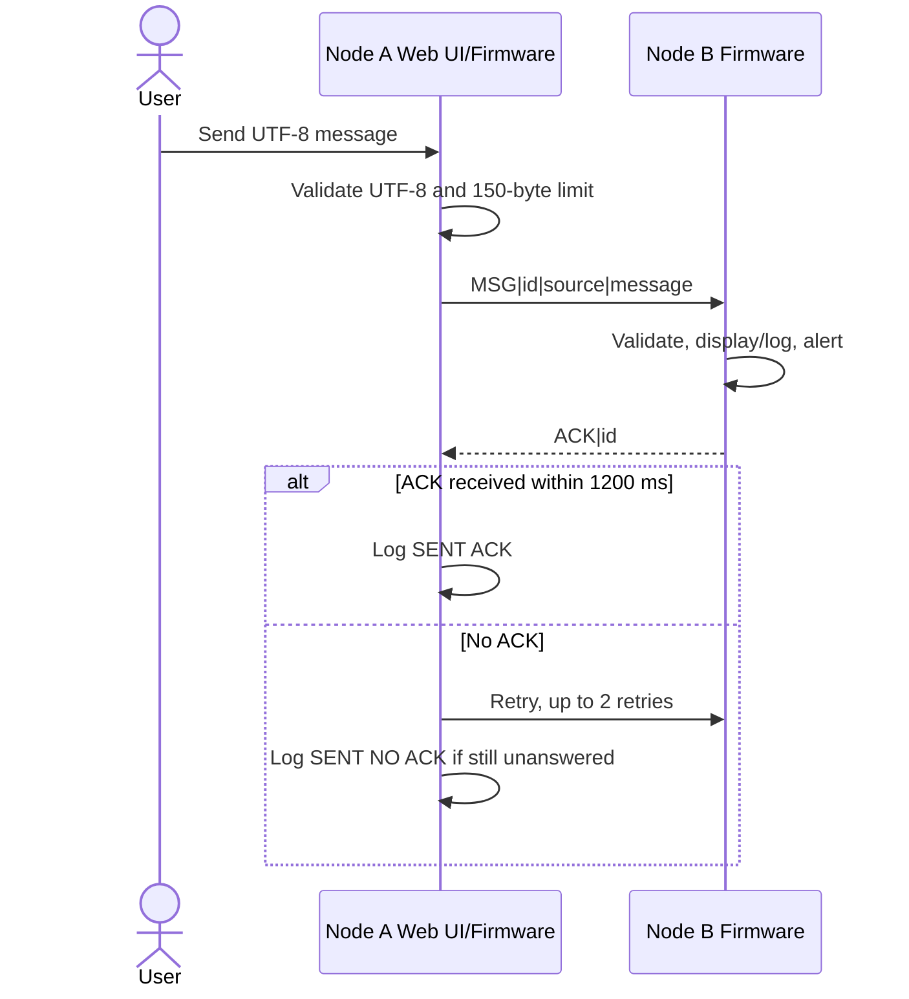
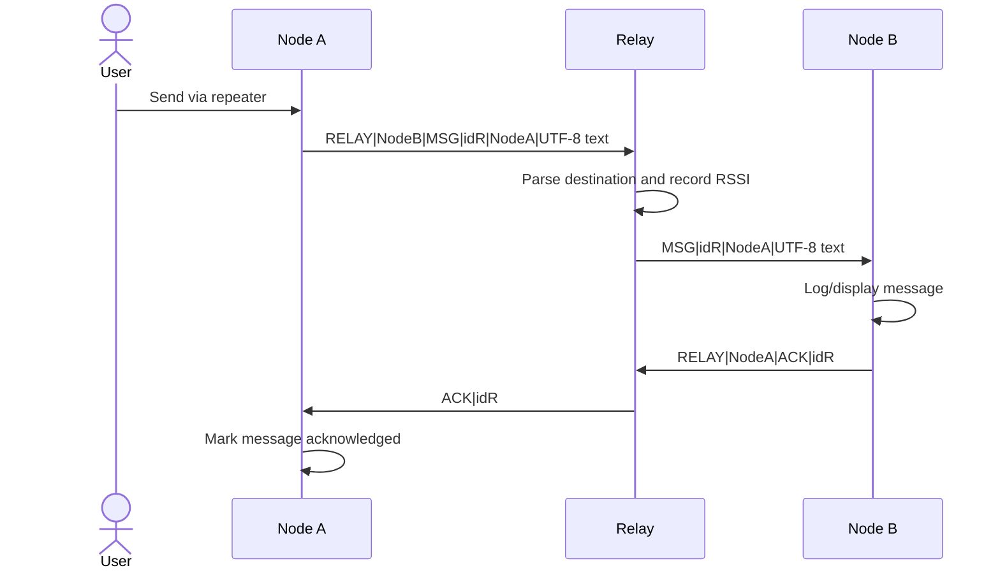
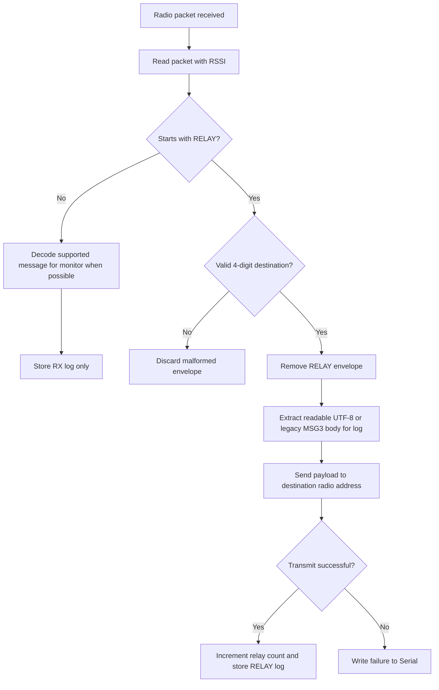
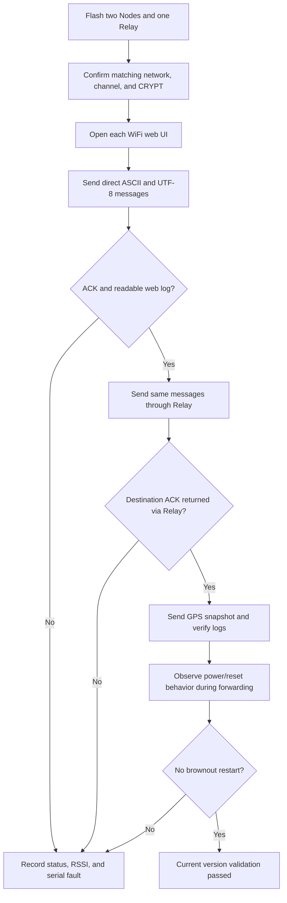

# Lomhor LoRa Software Roadmap - Current Version

This folder contains the current ESP32 software for a small LoRa messaging
network using E22-900T33S radios:

| Firmware | Role | Source |
| --- | --- | --- |
| Node | User device that sends, receives, acknowledges, and displays messages | `Node/Node.ino` |
| Relay | Fixed software relay that forwards addressed packets and monitors traffic | `Ralay/Ralay.ino` |

The goal of this version is to make message delivery usable from a phone or
computer through each device's WiFi web interface, including raw UTF-8 text
such as Khmer, while keeping relay activity visible for field testing.

## Current Version Scope

### Delivered In This Version

| Area | Node Software | Relay Software |
| --- | --- | --- |
| Web UI | Control panel, settings, power, device status, log, and nearby-node APIs | Monitor page, relay status API, and traffic log API |
| Messaging | Direct or relay-routed chat messages, GPS snapshot messages | Forwards `RELAY` envelopes to their destination |
| Reliability | ACK wait and retry, saved device/radio configuration | Single software forwarding path, fixed-size log entries, JSON escaping |
| International text | Validates and transports UTF-8 chat bodies; displays them in web logs | Extracts raw UTF-8 and decodes older `MSG3` base64 bodies in web logs |
| Field information | GPS, battery/charging, nearby nodes, RSSI, OLED screens, alert buzzer | GPS, RSSI, uptime, forward count, OLED status, boot reset reason |
| Radio setup | Address, target, relay, network, channel, key, and TX power are configurable | Address/network/channel/key are compiled settings |

### Current Operating Defaults

| Setting | Node | Relay |
| --- | --- | --- |
| WiFi access point | `LM-<node address>`; source default `LM-1` | `LMRalay-3` |
| Web address | `http://192.168.4.1/` | `http://192.168.4.1/` |
| AP password | `12345678` | `12345678` |
| Network ID | `0x01` | `0x01` |
| Channel | `0x41` | `0x41` |
| CRYPT key | `0x8002` | `0x8002` |
| Relay address | Default `0xFFFF` | `0xFFFF` |
| E22 TX power | Configurable from web UI | `POWER_22` in current source |

All communicating devices must share the same network ID, channel, and CRYPT
key. The relay constant is currently named `USB_SAFE_E22_TX_POWER`, but it is
set to `POWER_22`; USB-safe low-power behavior is roadmap work, not a delivered
feature.

## Software Architecture



### Software Modules

| Module | Responsibility |
| --- | --- |
| Node configuration | Loads and stores LoRa address, target, relay, network, key, AP name, power, and display preferences in ESP32 `Preferences` |
| Node web server | Serves UI and endpoints for sending messages, GPS snapshots, setup, status, logs, and nearby nodes |
| Node radio messaging | Formats UTF-8 frames, sends fixed-address E22 packets, waits for ACK, retries, and receives compatible older message frames |
| Node discovery | Broadcasts `HELLO` approximately every 5 seconds and keeps a nearby-node registry |
| Node device UI | Maintains OLED screens, navigation buttons, message alert buzzer, GPS state, and battery/charging display |
| Relay radio handler | Receives packets, parses `RELAY|destination|payload`, forwards only the payload, and records forwarding results |
| Relay monitor | Serves current status and the most recent traffic records to a browser |
| Relay device status | Maintains OLED display, GPS state, RSSI/activity information, and reset-reason serial logging |

## Runtime Flowcharts

### Node Startup And Main Loop



### Direct Message Delivery



### Message Delivery Through Relay



### Relay Packet Decision Flow



## Message Protocol In This Version

| Purpose | Frame |
| --- | --- |
| Current chat message | `MSG\|<messageId>\|<sourceAddress>\|<UTF-8 body>` |
| Relay request | `RELAY\|<destinationAddress>\|<payload>` |
| Acknowledgement | `ACK\|<messageId>` |
| Nearby-node beacon | `HELLO\|<address>\|<networkId>\|<channel>\|<role>\|<callSign>\|<optional lat>\|<optional lng>` |
| Legacy accepted chat | `MSG2` URL-encoded body and `MSG3` base64 UTF-8 body |

For relay-routed chat, the Node appends `R` to the message ID. The receiving
Node uses that suffix to return its `ACK` through the relay.

The web UI can display Khmer and other UTF-8 text. The default SSD1306 font
does not provide Khmer glyphs, so the OLED cannot correctly display Khmer text
in this version.

## Software Roadmap

### Phase 1 - Stabilize Current Field Testing

| Priority | Planned Work | Outcome |
| ---: | --- | --- |
| P0 | Change relay USB-safe TX power to a genuinely low-power setting and make the displayed TX-power text match the configured constant | Fewer USB brownout restarts and accurate diagnostics |
| P0 | Add duplicate-message suppression for ACK retries | A retry cannot create a duplicate received chat entry or repeated buzzer alert |
| P1 | Report failed forwarding, timeouts, reset reason, and radio errors in web status | Failures are visible without relying on Serial Monitor |
| P1 | Test direct, relay, ACK-return, UTF-8, and GPS message paths on real devices | A repeatable baseline for this release |

### Phase 2 - Define A Maintainable Protocol

| Priority | Planned Work | Outcome |
| ---: | --- | --- |
| P1 | Add a protocol version field and explicit message type schema | Future frames can evolve without `MSG`, `MSG2`, and `MSG3` ambiguity |
| P1 | Validate envelope lengths and UTF-8 consistently on Node and Relay | Malformed traffic is rejected predictably |
| P2 | Add delivery state and message IDs to exported logs | Field diagnosis can follow a packet end to end |
| P2 | Store health counters for RX, TX, invalid packets, retries, and forwarding failures | Long-running reliability becomes measurable |

### Phase 3 - Improve Operator Experience

| Priority | Planned Work | Outcome |
| ---: | --- | --- |
| P2 | Add conversation views, filtering, and log export to the Node UI | Operators can review communications quickly |
| P2 | Add selectable power profiles for USB, battery, and external radio supply | Deployment setup is clear and repeatable |
| P3 | Evaluate a Khmer-capable OLED font and memory cost | Local display support can be added only if practical |

### Phase 4 - Harden Deployment

| Priority | Planned Work | Outcome |
| ---: | --- | --- |
| P1 | Replace compiled default AP password with first-boot configuration | Devices no longer share public management credentials |
| P1 | Protect configuration endpoints and improve radio key handling | Radio and web settings are harder to alter unintentionally |
| P2 | Add firmware version reporting and configuration backup/restore | Installed devices can be maintained consistently |

## Version Validation Flow



## Build And Test Notes

Required Arduino libraries include `LoRa_E22`, `Adafruit GFX Library`,
`Adafruit SSD1306`, and `TinyGPSPlus` / `TinyGPS++`.

```bash
arduino-cli compile --fqbn esp32:esp32:esp32 Node
arduino-cli compile --fqbn esp32:esp32:esp32 Ralay
```

Power the E22 radio from a supply able to handle transmit-current peaks,
especially while the relay remains configured for `POWER_22`. A serial message
reporting a brownout reset indicates a power delivery issue that must be solved
before relying on relay tests.
